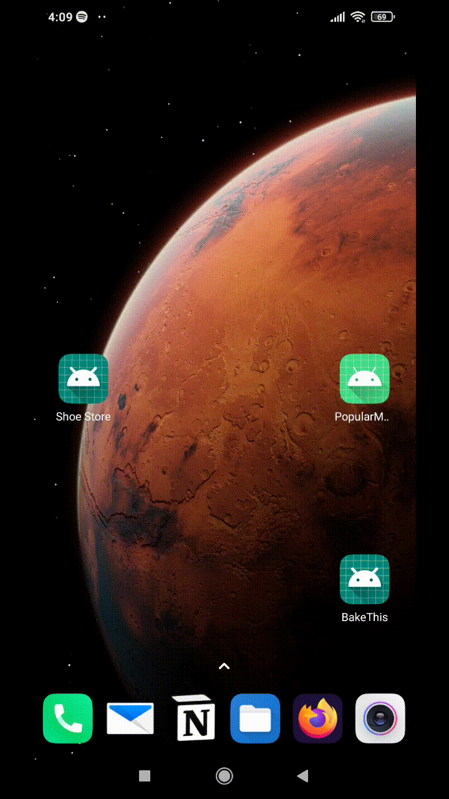
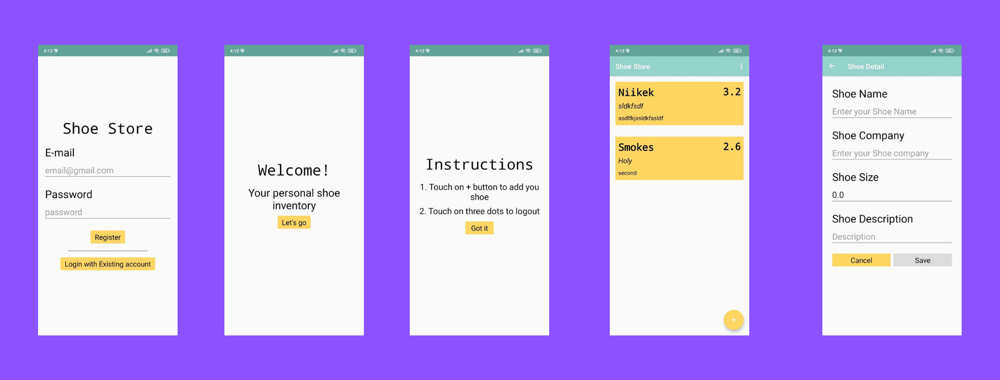

# Shoe Inventory App

## What does this app do ?

App with 5 screens : Login, Welcome Screen, Instructions, Main View and Screen for adding details about new shoe.
This app uses MVVM architecture to store "Shoe Object" created by the user.

NOTE : This app doesn't create SQLite database or communicate w/ backend. This is just for practising MVVM architecture, NavHostFragment, LiveData and other stuff.

## Features

- App is written in **Kotlin**
- App uses **MVVM Architecture**
- App with **5 screens** : Login, Welcome Screen, Instructions, Main View and Screen for adding details about new shoe.
- App uses **LiveData** to observe changes within the application.
- There is just one activity and **rest are Fragments**
- **NavGraph** contains all the navigation needed within the app.

# App Demo

# Screenshots

